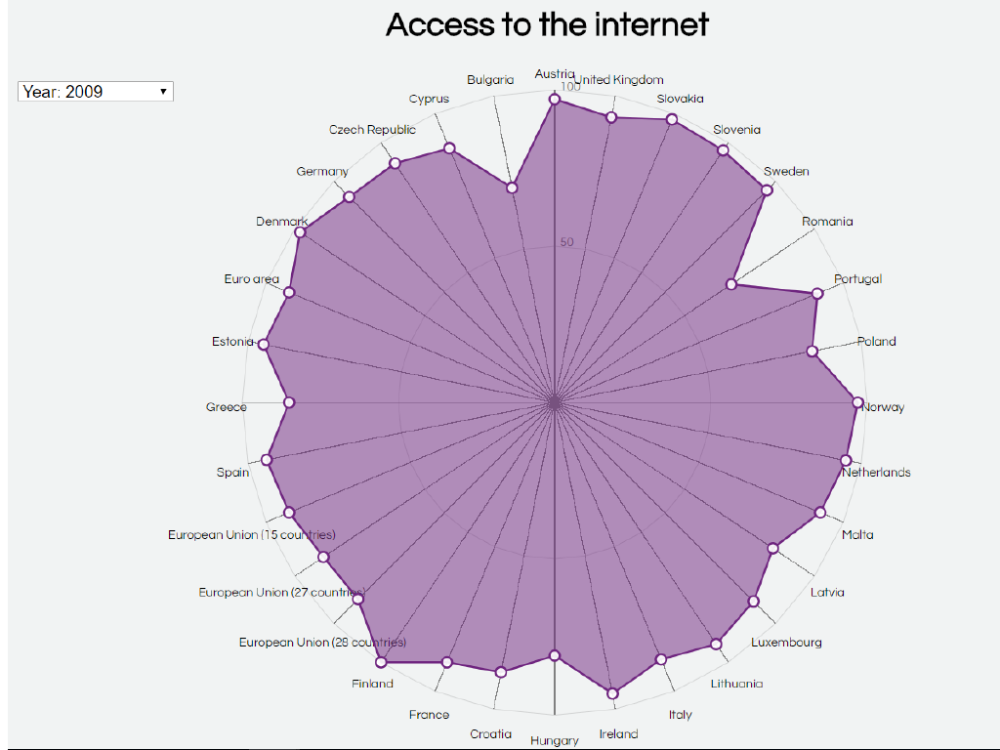

# Can you reach my internet?

In this assessment I used a dirty dataset, cleaned it and got a chart fully functioning. This chart is based [`bl.ock`](https://bl.ocks.org/alandunning/4c36eb1abdb248de34c64f5672afd857) by
[**@alandunning**](https://github.com/alandunning) (GPL-3.0).


> My work
> [**Velomovies**](https://velomovies.github.io/fe3-assessment-2/).

## Background

I used raw data for this chart. Under data it shows how I cleaned it. I used not all data from the set but only the most relevant. I chose a chart and tried to get it working. With some stackoverflowing around and a lot of conversations with my duck later I got it finally working. After I got it working I added my own code to make the chart myself. 

The most difficult part was to show the data that is selected in the select. I got that working with some funtions:
```javascript
  var sel = document.getElementById("yearSelect");
      var dropSelect = d3.select("select")
      dropSelect.on("click", selectUpdate)

      function selectUpdate(){
        ...
      }
```
When the select is clicked it will update te chart to the option that is selected in the select. I checked with another function what data it had to use:
```javascript
    var year = function(k) {
            for(var i in k) { if(sel.value == i) {
              return k[i]}}
          };
```
It checks if the value from the select the same is as the different data. When it is the same it returns the associated value.

I also added a few little thing. For example an `transition` and `on(click)`
```javascript
.transition().duration(2000).ease(d3.easeElastic)

circles.on("click", function())
```

> Next to the changes in the javascript I changed a few thing in the `css`. Like the font-family on the `body` and the `h1`.

## Data

[`Dataset from Eurostat`](http://ec.europa.eu/eurostat/estat-navtree-portlet-prod/BulkDownloadListing?file=data/isoc_ci_in_en2.tsv.gz&unzip=true). 
D3 is using a tsv (tab-separated value) file to make a visualization. The data was really dirty and there was a lot of data I could not use. I made my own cleaning code: 
```javascript
var header = doc.indexOf("indic_is,unit,sizen_r2,")
  doc = doc.slice(header)
  end = doc.indexOf("\n", doc)
  doc = doc.slice(end).trim()
  doc = doc.replace(/,+/g, "").replace(/ 	+/g, ",").replace(/	+/g, ",").replace(/ +/g, "").replace(/ +/g, "").replace(/:/g, "").replace(/u+/g, "")
  start = doc.indexOf("E_")
  end = doc.indexOf("33") - 19
  doc = doc.substring(start, end).trim()
  data = d3.csvParseRows(doc, map)

  function map(d, i) {
    if (d[1] == "" || d[2] == "" || d[3] == "" || d[4] == "" || d[5] == "" || d[6] == "" || d[7] == "" || d[8] == "") {
      return
    }
    return {
      country: countryNames[d[0]],
      y2016: Number(d[1]),
      y2015: Number(d[2]),
      y2014: Number(d[3]),
      y2013: Number(d[4]),
      y2012: Number(d[5]),
      y2011: Number(d[6]),
      y2010: Number(d[7]),
      y2009: Number(d[8])
    }
  }
```

* `metadata` — Information about where the data is comming from. I couldn't use that in my chart so cleaned it out
* `country codes` — The codes of a country. I made an array so the country codes where actual country names
* `2009 - 2016` - — There is data from 2009 till 2016. I used all of that in my chart.

## Features
*   [`d3-format`](https://github.com/d3/d3-format#api-reference)
    — `d3.format([number])`
*   [`d3-array`](https://github.com/d3/d3-array)
    — `max/min`
    — `d3.push` 
*   [`d3-selection`](https://github.com/d3/d3-selection#d3-selection)
    — `d3.select`
    — `on` mouse events
*   [`d3-request`](https://github.com/d3/d3-request#api-reference)
    — `d3.tsv`
    — Loading files

## License

GPL-3.0 © Victor Zumpolle
